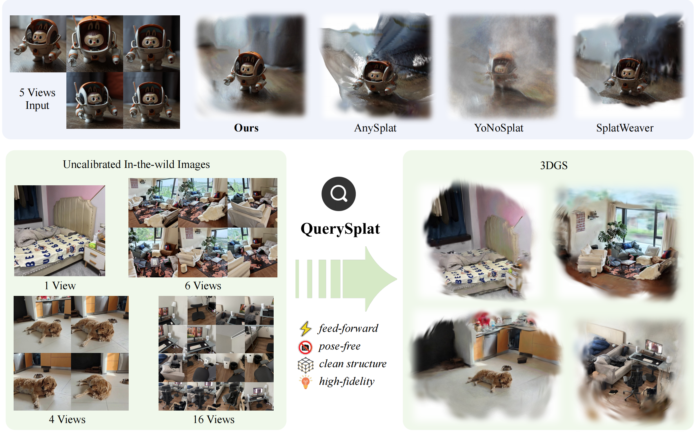

<h1 align="center">QuerySplat: Decoupling Geometry and Appearance Representations in 3DGS Prediction</h1>

<p align="center">Official implementation of <strong>QuerySplat</strong>.</p>

<p align="center"><a href="https://inspatio.github.io/querysplat/">Project Page</a> &nbsp;|&nbsp; <a href="https://huggingface.co/inspatio/querysplat">Hugging Face</a> &nbsp;|&nbsp; <a href="https://arxiv.org/abs/2608.01186">arXiv</a></p>

<p align="center"></p>

This repository contains the official inference implementation of QuerySplat. The release includes custom-image preprocessing, 3D Gaussian prediction and rendering, VGGT-Omega camera/depth prediction, and optional test-time optimization (TTO).

## Installation

QuerySplat requires Linux, a CUDA-capable NVIDIA GPU, and CUDA-enabled PyTorch. The release has been tested with Python 3.12, PyTorch 2.11, and CUDA 12.8.

```bash
git clone https://github.com/inspatio/QuerySplat.git
cd QuerySplat

conda create -n querysplat python=3.12 -y
conda activate querysplat

# Tested configuration: PyTorch 2.11.0 + CUDA 12.8.
python -m pip install torch==2.11.0 torchvision==0.26.0 \
  --index-url https://download.pytorch.org/whl/cu128
python -m pip install --no-build-isolation -r requirements.txt
python -m pip install -U huggingface_hub
```

`fused-ssim` is built from a pinned upstream source revision and uses the PyTorch/CUDA installation from the preceding step. The CUDA extensions used by `gsplat` and `fused-ssim` must be compatible with your PyTorch and CUDA installation. LPIPS may download its pretrained VGG16 weights on first use.

## Checkpoints

QuerySplat and VGGT-Omega weights are distributed separately. QuerySplat loads its geometry/appearance parameters from the QuerySplat checkpoint and loads the frozen VGGT-Omega aggregator, camera head, and depth head from the original VGGT-Omega checkpoint.

| Component | Download | Required path |
| --- | --- | --- |
| QuerySplat | [inspatio/querysplat](https://huggingface.co/inspatio/querysplat) | `checkpoints/querysplat_vggto_1B_512_8192.safetensors` |
| VGGT-Omega 1B/512 | [facebook/VGGT-Omega](https://huggingface.co/facebook/VGGT-Omega) | `checkpoints/vggt_omega_1b_512.pt` |
| Inference config | Included in this repository | `checkpoints/querysplat_vggto_1B_512_8192.yaml` |

```bash
mkdir -p checkpoints

hf download inspatio/querysplat \
  querysplat_vggto_1B_512_8192.safetensors \
  --local-dir checkpoints

hf download facebook/VGGT-Omega \
  vggt_omega_1b_512.pt \
  --local-dir checkpoints

sha256sum -c SHA256SUMS
```

The checkpoint directory must contain:

```text
checkpoints/
├── querysplat_vggto_1B_512_8192.safetensors
├── querysplat_vggto_1B_512_8192.yaml
└── vggt_omega_1b_512.pt
```

## Inference

Place any number of images from one scene in `--input_folder`. Run inference with TTO:

```bash
python -m scripts.infer \
  --config checkpoints/querysplat_vggto_1B_512_8192.yaml \
  --checkpoint checkpoints/querysplat_vggto_1B_512_8192.safetensors \
  --input_folder data/my_scene \
  --output_dir outputs/my_scene \
  --use_tto
```

Omit `--use_tto` to run the feed-forward model without test-time optimization.

### Important Options

- `--tto_n_steps`: Number of TTO optimization steps. Default: `20`.
- `--tto_lr`: TTO learning rate. Default: `5e-3`.
- `--tto_lpips_weight`: LPIPS weight in the TTO reconstruction objective. Default: `0.05`.
- `--tto_save_step STEP [STEP ...]`: Save additional Gaussian PLY files at the requested TTO steps.
- `--gaussian_save_opacity_threshold VALUE [VALUE ...]`: Opacity thresholds for Gaussian PLY export. Multiple values produce one PLY per threshold. Default: `0.05`.
- `--save_gaussian_alpha_distribution`: Save Gaussian opacity distribution statistics and plots.
- `--save_gaussian_scale_distribution`: Save Gaussian scale distribution statistics and plots.
- `--save_predicted_input_cameras`: Export predicted input cameras as JSON and NPZ files.
- `--save_vggt_input_depths`: Export per-view VGGT-Omega depth and confidence products.
- `--save_vggt_depth_pointcloud`: Export a colored point cloud reconstructed from VGGT-Omega depth predictions.
- `--vggt_depth_pointcloud_target_points N`: Target number of depth point-cloud samples; required with `--save_vggt_depth_pointcloud`.

## Acknowledgements

QuerySplat builds on and benefits from [VGGT-Omega](https://huggingface.co/facebook/VGGT-Omega) for image encoding, camera prediction, and depth prediction, and [TokenGS](https://github.com/nv-tlabs/TokenGS) for important implementation foundations and references.

## Citation

```bibtex
@article{li2026querysplat,
  title={QuerySplat: Decoupling Geometry and Appearance Representations in 3DGS Prediction},
  author={Li, Yinglong and Shen, Donghui and Zhang, Xiaoyu and Ye, Zhichao and Wu, Hongyu and Hao, Aimin and Zhang, Guofeng and Liu, Haomin},
  journal={arXiv preprint arXiv:2608.01186},
  year={2026},
  url={https://arxiv.org/abs/2608.01186}
}
```

## License

Copyright (c) 2026 Inspatio. All rights reserved.

The QuerySplat-authored portions of this release are provided under the Apache License 2.0. See [`LICENSE`](LICENSE) and [`NOTICE`](NOTICE) for details. The vendored VGGT-Omega/DINOv3 source is provided under the [FAIR Noncommercial Research License](third_party/vggt_omega/LICENSE) and retains its original upstream notices.
